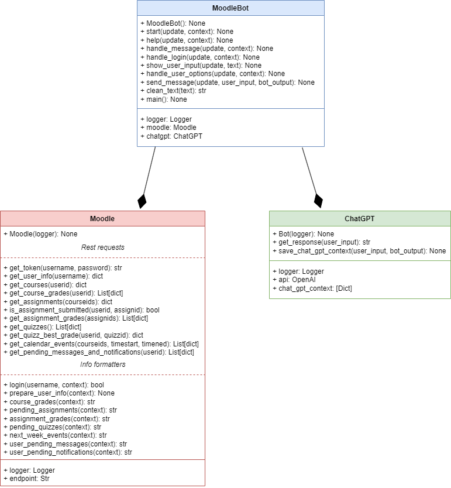
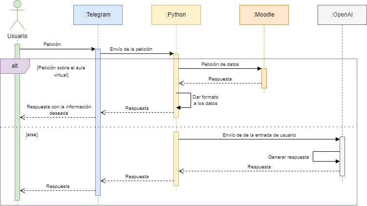

# Moodle chatbot

This project implements a chatbot that connects with the Moodle web services through REST requests.

## How it works

### Inside the project

There are 3 main files in this project, each one containing a class with the same name:
- **main**: contains the main function and everything needed to connect with Telegram, including the user input handlers.
- **chatgpt**: connection with the OpenAI API to send request to ChatGPT.
- **moodle**: webservices REST requests to Moodle and data formatting functions.

This diagram represents the relation between the different classes:




## Requirements

It needs an OpenAI key and a Telegram bot api-key to work. These info and all the Moodle info is located in **.env** file.

## Installation

To start this app, the next libraries are needed:
```shell
pip install python-dotenv python-telegram-bot openai requests
```

## Sequence diagram


